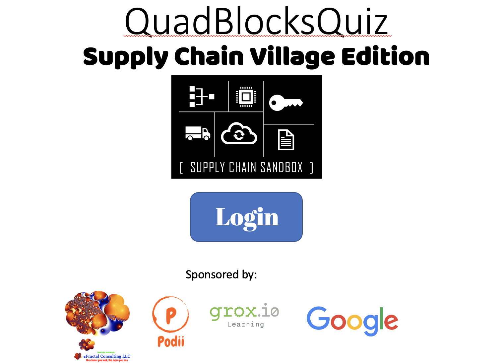
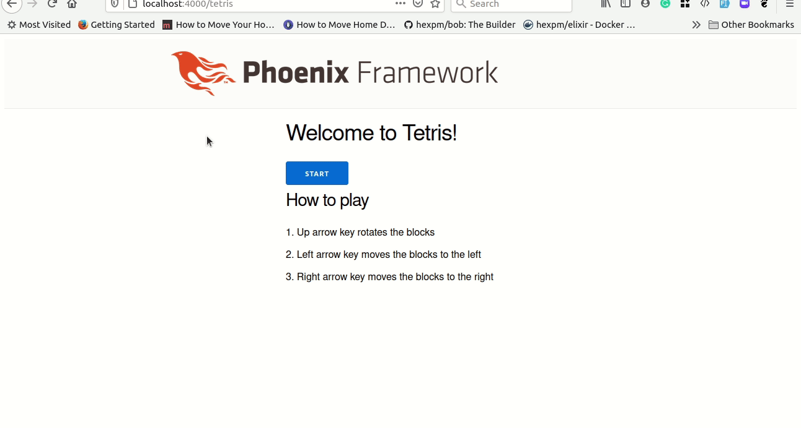

# QuadBlocksQuiz - Supply Chain Edition
QuadBlocksQuiz is a tetrominoes-like game
that is part tetrominoes and part trivia quiz.
Being honest, the trivia is to educate on
supply chain.

## 1. Getting started
This instance authenticates using GitHub
(see here for more) therefore you mush have a GitHub ID
and the conference organizers must have added you to
the authorized list.
If you are not yet authorized, see *here* for more info.

Clicking on login will authenticate with Github.

**replace this with current example**

## 2. Playing

QuadBlocks or Tetrominoes
are shapes made from 4 squares.
In this game there are
.

QuadBlocks fall from top of screen

Their fall is influenced by:
- Clicking the left-arrow key moves the quadblock one block to the left
- Clicking the right-arrow key moves the quadblock one block to the right
- Clicking the up-arrow key rotates the block one quarter turn

**replace this with current example**

## 3. Objective
To score the most points
- Points accumulate with each tick of the clock
- Completed rows are removed and add points (in addition to letting you play longer)
- Answering questions add points as well as potentially giving powerups
- Game ends when the quadblocks pile up and reach the top of the playing area

## 4. Pausing / Questions
Typing the space bar pauses the game

A topic screen is displayed,
allowing the player to either continue back to the game
or answer questions for points and powerups

**replace this with current example**

## 5. Topics / Power-ups

### 5.1 Supply Chain
- This is the supply chain sandbox so obviously everything is about supply chain.
- Questions in this section are historical and misc.
- Answering incorrectly loses points and you remain paused until you answer correctly
- Answering correctly gets you points.

### 5.2 SBOM
- Software Bill of Materials is a critical element in supply chain risk management for both licenses and for vulnerabilities. It is also useful for software architecture (who needs 10 different modules with 27 different versions – all to perform the same function).
- More information at https://www.ntia.gov/sbom
- Answering incorrectly loses points and you remain paused until you answer correctly.
- Answering correctly gets you points and a ‘bomb’ powerup which allows you to ‘blow up’ one block (and if you answer enough SBOM questions, blow up an entire row)

### 5.3 OpenC2
- Automating the defense is a key to cybersecurity. Open Command & Control (OpenC2) is a standardized language for the command and control of technologies that provide or support cyber defenses. By providing a common language for machine-to-machine communication, OpenC2 is vendor and application agnostic, enabling interoperability across a range of cyber security tools and applications. The use of standardized interfaces and protocols enables interoperability of different tools, regardless of the vendor that developed them, the language they are written in or the function they are designed to fulfill.
- More information at https://openc2.org/
- Answering incorrectly loses points and you remain paused until you answer correctly.
- Answering correctly gets you points and a ‘C2’ powerup which allows you to ‘command & control’ one block (and if you answer enough OpenC2 questions, an entire quadblock) to put where you want

### 5.4 OpenChain
- The OpenChain Project helps to identify and share the core components of a high quality open source compliance program. OpenChain builds trust in Open Source by making things simpler, more efficient and more consistent. It is the industry-standard for managing Open Source compliance across the supply chain.
- More information at https://www.openchainproject.org/
- Answering incorrectly loses points and you remain paused until you answer correctly.
- Answering correctly gets you points and a ‘Chain’ power-up which prevents black blocks (preventative upstream in supply chain)

### 5.5 Phoenix
- Phoenix is a web development framework written in Elixir which implements the server-side Model View Controller (MVC) pattern. Phoenix provides the best of both worlds - high developer productivity and high application performance. It also has some interesting new twists like channels for implementing realtime features and pre-compiled templates for blazing speed. The 'let it fail' philosophy of the underlying OTP ecosystem makes it easier to design in both reliability and security.
- More information on Phoenix Framework at https://www.phoenixframework.org/
- More information on Elixir at https://elixir-lang.org/learning.html
- More information on OTP at https://grox.io/language/otp/course and https://youtu.be/NYkwvVKlbU8
- More information on Erlang Ecosystem Foundation at
- Answering incorrectly loses points and you remain paused until you answer correctly
-  Answering correctly gets you points may get a ‘Rebirth’ powerup removing all blocks but keeps your score (and crediting points for the blocks removed), or may get you a ‘reliability’ powerup which "corrects" the vulnerable ‘black block’ into normal removable blocks.

### 5.6 Vendors
- this game, this sandbox, would not be possible without sponsors. Please read about them and answer easy questions to gain points and powerups (row delete)
- sFractal Consulting - Platinum Sponsor - designed this game, wrote software, funded additional developers, ... sFractal Consulting is a boutique software/cybersecurity consulting firm.
    + sFractal Consulting strongly believes in Supply Chain Risk Management, and assists its clients with quantitative risk management, SBOM creation as part of the SDLC, and Open Chain.
    + sFractal Consulting strongly believes in creating SBOMs for all software, but confesses to not always being able to walk that talk. SBOMs are available for this game, but not for all the software sFracal has created. sFractal Consulting commits to continuous improvement in this area and to slowly grow the SBOM corpus will all new software it creates or updates
    + sFractal Consulting strongly believes in cybersecurity automation and is very active in OpenC2. For example the security of this website is under OpenC2 Control
    + sFractal Consulting commits to improving it's OpenChain behavior, fully admitting it has not been a focus but intends to change that
- Podii - In-kind Sponsor - developed much of the quiz software for this game, building on the work of Grox.io. Podii develops "software done right".
    + blah blah on supply chain, SBOM, OpenC2, OpenChain
- Grox.io - In-kind Sponsor - developed much of the quadblocks software that is the basis for this game. Grox.io teaches programming. The tetrominoes game that is the basis of this game is developed as part of a Grox.io course.
    + blah blah on supply chain, SBOM, OpenC2, OpenChain
- Google - In-kind Sponsor - Google donated the GCP resources to host this game
    + blah blah on supply chain, SBOM, OpenC2, OpenChain if we can get statements
